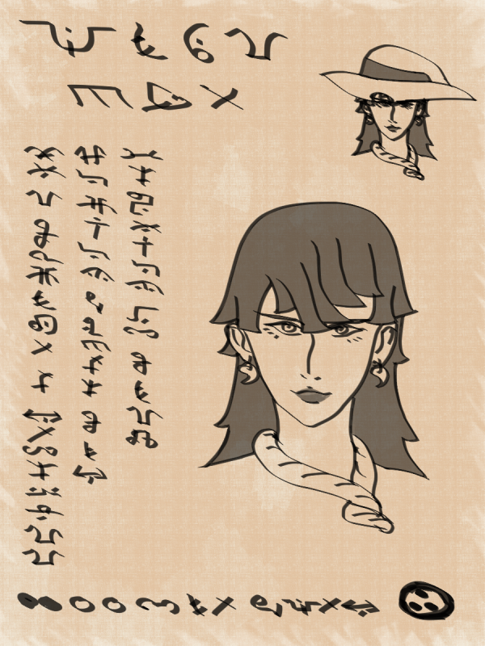

# The Lilliputian Exalted

You tried to save your people, but you failed. Maybe it was because power naturally accumulates in the hands of the few. Maybe it was because when you needed your people to stand alongside you, they were too stricken by fear to rise. That is when your new mother found you and made your heart new again. You have found experience in your loss, and you will share that with all who need it. Together with your new siblings, you will never truly lose again.

You are Lilliputian Exalted if you want to be a spiritual parent of your local community, a wandering teacher of miracles, or an iconoclast who despises the world's reliance on individual heroes.

I can't wait to meet you.

With love,
Your mother Lillun

> As a Lilliputian Exalt, you were hand-picked for a second chance by your mother Lillun. You returned to the task which once overwhelmed you wielding music your mother stole from the Makers. You have seen the true shape of humankind, and you will grant that gift to the kind and common people which cradled your own divinity. You have been Exalted less than a year.

## Lilliputian Exalt Advantages

**Though Little, Fierce**: While you are at your Critical health level or at four or more anima, the breath of war restores two motes instead of one, and you recover one mote between actions during social influence scenes or ventures.

**Quality Time**: The thread of destiny which binds your second soul to your mother can transmit thoughts and feelings. Together, your family can solve most any problem. Once each scene, you may ask your siblings one question about any topic, whether as specific as "How do you pick this lock?" or as conceptual as "What were the main causes of the Solars' downfall?" You may also use this ability to send a message. If you are slain in combat, your new family will always hear your last words.

**Resonance**: You resonate with orichalcum.

**Mama's Little Monster**: A god-monster dwells in the heart of every human. Your ancestry makes it much more literal. You may learn the charm Clay Doll Liberation. Until you do so, you may activate it anyway once you have reached your last Critical health level.

## Anima

Your anima banner shines in any of the twenty-three ancient colors of the Makers. As it grows, the shape and power of your inner monster begins to manifest, though your people will only ever see it as a protector, no matter how fierce it becomes. Just mind your temper. If you find your anima tinging a sickly green, take a moment to find yourself. It is perfectly natural but a sign you are in danger of becoming intoxicated by your own power.

## Lilliputian Castes

The Lilliputian castes recall the five songs of the ancient Makers. Our family has inherited these songs, and it is our duty to spread their beauty to all humanity. As your anima banner grows, you will find echoes of your caste's song in the very movements of your inner monster.

### March

Sometimes, the only constant is the ancient and unbroken might of brute force. Sometimes, raw violence is the only shared language. March is the song of the Makers gone to war with Chaos. March is your song of taking up arms to protect your home from invaders. March is your song of taking life back from tyrants. The heartbeat of your inner monster is a drum which guides your people.

At the end of each session, you gain an Exalt Milestone if you used physical force to resolve an insurmountable social or mental problem.

#### Anima Effects

**What Did You Say About My Mama?** (Passive): Each round, you can defeat up to your Essence in Extras without rolling. When you damage a battle group, increase the difficulty to resist a rout by one, to a maximum of five.

**Not Angry, Just Disappointed** (Active): Add your Essence in automatic successes on social actions to convince a foe of their guilt or complicity.

**Mama Didn't Raise No Quitter** (Iconic): The Makers think themselves strong for enduring the torment of their own kind. It was our kind which invented Death. Show them what you have endured. At 10 anima, you may use Clay Doll Liberation without paying the cost. While transformed, you ignore wound penalties.

### Hymn

Everyone wants to believe in something bigger than themself. Something which could magically sweep all their troubles away. Hymn is the song the Makers sang to celebrate the Queen of Heaven. Hymn is your song of banishing your own doubts. Hymn is the song of your people coming together for something bigger than all of us. Your inner monster seems to glimmer with the rise and fall of a distant aria.

At the end of each session, you gain an Exalt Milestone if you gathered forces for a greater good despite personal cost to all involved.

#### Anima Effects

**Mama Said** (Passive): Extras and non-heroic mortals cannot ignore your social actions and assume you represent an authority they trust until proven otherwise.

**You're in Trouble** (Active): Add your Essence in successes on social influence rolls when your opponent has reason to believe a third party will intervene on your behalf.

**Hail Lillun** (Iconic): I am not worthy of veneration, but neither is anyone else. Cut down the grifters before they sell your people dragon oil. While your anima is iconic, your attacks deal aggravated damage to heads of cults, whether god, demon, or fellow Exalt.

### Saga

Stories are what shape cultures. What do we sing to our children as they sleep? Those are the dreams they will chase when they are older. Saga is the song of the Makers inventing worlds and kings. Saga is your song of discovering new friends and new ideas. Saga is the song of your people bringing you tales of hard-won victory. Your inner monster's stride is a palpable rhythm, the meter of your glory.

At the end of each session, you gain an Exalt Milestone if you used your knowledge to enhance a significant community or organization of mortals.

#### Anima Effects

**Favorite Sibling** (Passive): Reduce the base number of obstacles you must overcome on a venture involving investigation, research, or planning by 1, to a minimum of 1.

**Inherit the Earth** (Active): Add your Essence in automatic successes for Craft or Sagacity rolls, or to Focus Will for spellcasting.

**Tell My Mother's Story** (Iconic): Your siblings will give you more than wisdom if you know how to ask. Spend 4 anima and choose any Universal or Lilliputian charm. For the rest of the scene you may use it, even if you do not meet the requirements.

### Nocturne

Night is often when we find ourselves. For some, it is quiet. For some, it is the only time we truly live, freed from the shackles of day's labors. Nocturne is the song of the Makers as they beheld Creation. Nocturne is the song of the world's powers looking away. Nocturne is your song of liberation, when you are free to plot or celebrate or whatsoever you please. Your inner monster is graceful and beautiful, its every movement flowing with the sonorous sound of your breathing.

At the end of each session, you gain an Exalt Milestone if you perform a major act of sabotage or of exploiting the local nightlife.

#### Anima Effects

**Just One of the Family** (Passive): You dampen your anima from detection unless you want it to be seen.

**Familiar Presence** (Active): You wrap your anima around yourself, passing unseen among Extras. Add your Essence in automatic successes to Athletics and Stealth rolls around non-trival characters. If you're detected, your identity can’t be determined.

**Mama's Lullaby** (Iconic): How did I escape the Makers with my whole entourage? I walked. They didn't think I would dare. While your anima is Iconic, it cloaks others in the same sense of familiar certainty. Allies within your Essence in yards gain the benefit of your other Anima effects.

### Anthem

There comes a time when individuals are not enough. There comes a time when adventure weighs on the bones, and most put down roots. They sell their wisdom to the young, and the adventure begins anew. Anthem is the song of the Makers' castoffs forging kingdoms of their own. Anthem is your song of declaring independence. Anthem is your song of declaring you will never be alone again. Your inner monster glimmers with a contagious glory, splitting light like a prism to illluminate your allies.

At the end of each session, you gain an Exalt Milestone if you forced powerful supernatural forces to bargain with mortals as equals.

#### Anima Effects

**Family Friends** (Passive): Like your Eclipse counterparts, you may learn Eclipse-keyword Charms from spirits, fair folk, and other supernatural beings and seal pacts by the power of the Makers. You pay the same anima cost to seal oaths as Eclipses.

**Mama Will Break Your Legs** (Active): While negotiating with spirits, Fair Folk, or ghosts, you and your allies must be given safety and hospitality. Promises or deals made during these negotiations are sanctified; your mother knows immediately when these oaths are broken. All Lilliputians are honor-bound to visit their wrath upon an oathbreaker. Some of your siblings are vicious indeed.

**Apple Didn't Fall Far** (Iconic): Everything bad that's ever happened is because spirits and mortals alike refuse to take responsibility for their actions. They've been given entirely too much rope. Time to hang the gods. Spend 5 anima and accuse any character present of crimes against humanity. All the spirits of justice I've compelled to service will weigh your arguments and perform suitable punishment if your evidence sways them.

## The Great Curse

The true bite of the Great Curse is the knowing that its outbursts may be contained. So many Exalted are without the tools or the help they need when they struggle beneath the burden of heroism. Your own burden is greater for your ancestry. If you slip, your inner monster will break free and in the throes of terrible passion.

All Lilliputians possess additional conditions which may incite the Great Curse:

- Your plans are undermined by allies or subordinates taking "good enough" steps.
- You use your stolen power for unacceptable ends.

When you succumb to the Curse, you will throw an **Atavistic Tantrum**. All Tantrums last for a scene, during which you will be unable to leave your monstrous form. You may choose how to pay for Clay Doll Liberation as normal, but you _must_ transform.

**Best Enemy Recognition**: In the Time Before, the Makers compelled all and told all stories. Though they do not admit it, nothing fascinates them more than that which they cannot command. By spending much of your time among those you must guide, you too may find yourself unnaturally craving the attentions of a supernatural equal.

If you do not already possess a Major Intimacy toward a significant enemy, form a new one or improve an existing Intimacy to Major. The context of the Intimacy may be anything, positive or negative. For the duration of the Tantrum, you will fixate on that enemy, bending your plans to involve them despite any risk. You need not involve them directly if doing so is infeasible, but they must be made aware that your plans are afoot and given suitable clues to appropriately challenge you.

**Fiendish Deathtrap Compulsion**: The Makers are older than Time and Death. Each of them is a world to themself. They sometimes overlook the individual moments which are so important to we humans. You too may find yourself overly certain in your power and longevity.

For the duration of the Tantrum, you are unable to see tasks to completion. You will prefer to delegate tasks to others, even if the tasks are too great for them. You will trust in any bureaucracy or machinery you have established. If you are forced to intervene directly, you will leave tasks half-done, even combat. Certainly, your enemies are no threats to you if you have taken their weapons…

**Infernal Genius Declaration**: The Makers, for all their glory, are often lonely and insecure. They seek validation from their subordinate souls and their peers, wanting to earn some new recognition before they all move on to the next fascination. With this power, you may find yourself falling into the same trap.

For the duration of the Tantrum, you must inform all that you can of the glories of your plans. Though you need not immediately jump to divulging your greatest secrets, they may easily tumble from your lips as you insist to your nemesis that your plans could not be stopped even with such knowledge.

**Kindly Butcher's Benediction**: The Makers became many things to stand against Chaos. They became many things anew when your ancestors sealed them away. The reshaping of body and mind is mundane to them. Already, you see the power of your inner monster. You may wish to share this enlightenment with others.

For the duration of the Tantrum, you become obsessed with improving those around you. No one is ever good enough, and you simply _must_ reshape them, whether for aesthetics or improved function. If you possess charms which can cause mutations, you will prefer to use these. If you are capable of drastic surgery or other means, you will seek to employ them. With no other options, you will simply barrage others with social attacks, seeking to convince them to see the truth in your vision.

**Thoughtless Filicide Consumption**: The Makers' souls have souls of their own. The characters of their dramas had always been parts of themselves or ephemeral scraps created for an uncredited role. They do not truly know how to acknowledge lesser creatures. There may come a dark hour where you are so divorced from your origins that you suffer the same.

For the duration of the Tantrum, you reflexively take credit for the actions of your subordinates and allies, no matter how temporary. You are not yet incapable of giving them credit, but you hold the unshakable belief that they only had the opportunity for greatness because you provided it to them. Accordingly, all blessings are yours.